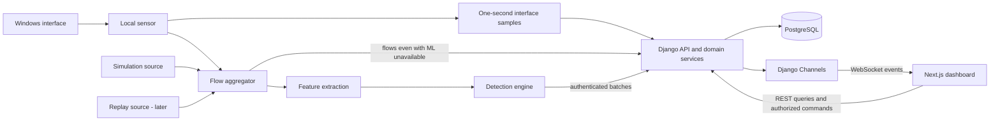

# Architecture

## Components and ownership

Use a modular monolith for the web application plus a separate local sensor process. PostgreSQL is the durable source of truth. The ML/detection engine is a reusable Python package, initially executed by the sensor's pipeline runner, not a network microservice. Training runs as an explicit offline operation; Django records approved model metadata.

Detection produces anomaly scores and metadata-derived rule evidence. Django applies authoritative, versioned incident correlation and risk policy using stored context. MVP rules use only locally available window data and bounded rolling state; rules requiring backend-only history are deferred. Keep reusable rule/risk calculations free of Django dependencies. The browser neither captures nor evaluates security decisions. Sample and flow publication are independent of detection success.

## Runtime and contracts

The sensor owns capture, bounded queues, event-time aggregation, feature extraction, and inference. It has no database credentials. A limited sensor credential binds it to an enrolled source and allowed modes. The backend validates batch shape, provenance, model/schema compatibility, quotas, and idempotency before committing related records in a transaction.

The sensor is independently runnable: local operator configuration authorizes capture; local session UUIDs, interface samples and window summaries work with no Django installation, backend connection or model. HTTP is an optional output sink. Once enrolled, it registers locally generated sessions under its allowed scope before uploading. Backend outage cannot stop local observation; bounded spooling can lose old data explicitly. Offline capture permission is local OS/operator authority, not a remotely revocable backend lease. Backend revocation denies upload; immediate offline revocation is not promised. MVP capture starts/stops locally; remote control is advanced.

Capture callbacks only normalize allowed metadata and enqueue it. Flow/feature processing and inference consume bounded queues outside callbacks; model failure/lag cannot block sample output. Start within one sensor process if measured adequate; isolate inference in a worker only if profiling proves necessary. The Windows capture component stays native even if a future backend runs elsewhere.

Ship flow/features as telemetry, and scores/rule findings as a separately acknowledged analysis stream. Reject incompatible analysis without discarding valid samples/flows. Inference may run offline immediately; upload analysis only after its referenced feature is durably accepted, and register trusted model/rule manifests before uploading findings. This avoids model activation/version mismatches taking down monitoring. Neither stream may silently skip invalid data or retry forever.

Ingestion acknowledges only durable acceptance. Duplicate retries return the original receipt. Publish WebSocket notifications after commit, never before it. Socket messages are hints; clients reconcile using REST after reconnect or gaps. A crash between commit and publication can lose a notification but cannot lose committed records. Add a durable outbox only when reliable push delivery becomes a requirement.

Source mode and session ID are immutable provenance throughout telemetry, detections and analytics. Devices may span LIVE sessions in one scope; lab identity namespaces include run ID. Every mode-scoped relationship must be validated, not inferred from an on-screen switch. A page selects one mode and source/run; combined research comparisons explicitly label each series. Live training accepts only reviewed LIVE sessions by default. No synthetic fallback on capture failure. Simulation runs use a separate session/state/credential profile from capture; never inject synthetic packets onto an interface.

## Laptop deployment plan

Initially run one Next.js process, one Django ASGI process, PostgreSQL, and one local pipeline process. An on-demand simulation CLI uses the same package with isolated state; this is not another always-on service. All HTTP ingestion and WebSocket consumers must run in the same ASGI process (no separate WSGI server, runworker or multiple workers). The sensor and lab CLI POST through HTTP; they never call group_send or write the database. A local-demo in-memory layer can then publish from post-commit callbacks inside the receiving ASGI process. In-memory messaging is expressly unsuitable for production/multiple processes in the [Channels documentation](https://channels.readthedocs.io/en/latest/topics/channel_layers.html).

Use explicit offline CLI training, local simulation launch, a bounded synchronous CSV export and scheduled cleanup initially. CLI jobs that modify the DB do not publish through in-memory Channels; the UI periodically refreshes their state via REST. Add UI-triggered jobs only with a defined single local runner, cancellation and persistent status. Do not spawn untracked background tasks from requests. Celery is outside the native-Windows MVP: its project [does not support Windows](https://docs.celeryq.dev/en/main/faq.html#windows). A later supported worker runtime/Redis deployment needs a new decision and budget; neither is installed by default.

Keep REST polling as a visible fallback (every 5 seconds while the active page is open), and reconcile every 15 seconds even with a socket connected so a lost final event is not invisible forever. Record freshness by observed time, not receipt time. Bind services to loopback by default; nonlocal deployment requires HTTPS/WSS and a new deployment decision. Demonstration engineering quality does not make this a production deployment.

## Failure behaviour

| Failure | Required behaviour |
| --- | --- |
| Missing Npcap/permissions/interface | Actionable error; OS_COUNTERS_ONLY remains useful when available, with packet flows/features unavailable; not sufficient for Sprint 1 packet gate |
| Backend unavailable | Bounded metadata spool and retry with backoff; report discarded records when cap is reached |
| Sensor heartbeat absent | Stale/unknown health, last-seen time, no implied current traffic |
| Model absent or incompatible | Collection continues, ML status unavailable; independently valid rules may run with source shown |
| Overload or incomplete windows | Count drops, mark partial features, avoid ordinary scoring of invalid windows |
| Socket interruption | Reconnect with backoff and refresh REST snapshots |
| Disk quota exhausted | Stop/spool-discard according to documented policy; expose failure, never unbounded writes |
| Laptop sleep/resume, clock jump, adapter/network change | New session/time epoch, invalidate partial windows/baseline compatibility and mark a gap; reset counter rates, no negative/spike fabrication |
| Post-NAT/unknown attribution | Host/interface totals only; no invented client device scores |
| No anomalies / no supported rules | Continue live activity/history; show no findings plus detection availability, not a safety verdict |
| Batch/model version mismatch | Quarantine analysis separately with visible error; valid telemetry continues |
| Lab runner absent or model activation pending | Explicit waiting/failed state; never show requested state as applied |

## Decision register

| ADR | Decision | Reason and consequence | Status |
| --- | --- | --- | --- |
| 001 | Modular Django monolith plus local sensor | Clear privileges and ownership without many services | Accepted |
| 002 | Metadata/flow persistence, no payload by default | Reduces privacy and storage burden; limits content-based conclusions | Accepted |
| 003 | Isolation Forest plus separate interpretation | Scientific honesty; requires independent rule evaluation | Accepted |
| 004 | Provenance partition in every pipeline stage | Prevents demo/replay contamination; adds contract checks | Accepted |
| 005 | PostgreSQL plus post-commit socket hints | Simple durability; REST reconciliation required | Accepted |
| 006 | Single ASGI process before Redis | Laptop simplicity; cannot scale workers with in-memory messaging | Provisional until runtime validation |
| 007 | Offline training, sensor-local inference | Keeps requests fast; requires trusted artifact distribution and version handshake | Accepted |
| 008 | Scapy-first capture spike, PyShark alternative | Select based on Windows correctness/overhead; neither is yet mandated | Open: Sprint 1 |
| 009 | Host/interface-first observation | Remote-device attribution cannot be assumed from discovery/NAT; device models are experimental | Accepted |
| 010 | Independent sensor and two publication cadences | Useful without backend/model; real samples every second, findings from finalized 10-second windows | Accepted |
| 011 | Shared feature compatibility gate | Dataset column names alone do not establish live compatibility | Accepted |
| 012 | Local CLI controls/lab launch before browser jobs | Avoids an undocumented task queue and remote privileged execution in MVP | Accepted |
| 013 | Early age/row/disk telemetry budgets | A bounded capture queue does not bound PostgreSQL growth | Accepted |

Logical future directories may be frontend/, backend/, sensor/, detection/, and tests/. These are design boundaries only; Sprint 0 creates none of them.
