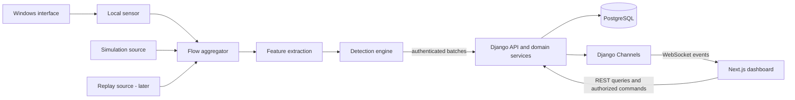

# Architecture

## Components and ownership

Use a modular monolith for the web application plus a separate local sensor process. PostgreSQL is the durable source of truth. The ML/detection engine is a reusable Python package, initially executed by the sensor's pipeline runner, not a network microservice. Training runs as an explicit offline operation; Django records approved model metadata.

Detection produces anomaly scores and rule evidence. Django applies authoritative, versioned incident correlation and risk policy using stored network context. Keep reusable rule/risk calculations free of Django dependencies; domain services orchestrate persistence. The browser neither captures nor evaluates security decisions.

## Runtime and contracts

The sensor owns capture, bounded queues, event-time aggregation, feature extraction, and inference. It has no database credentials. A limited sensor credential binds it to an enrolled source and allowed modes. The backend validates batch shape, provenance, model/schema compatibility, quotas, and idempotency before committing related records in a transaction.

Ingestion acknowledges only durable acceptance. Duplicate retries return the original receipt. Publish WebSocket notifications after commit, never before it. Socket messages are hints; clients reconcile using REST after reconnect or gaps. A crash between commit and publication can lose a notification but cannot lose committed records. Add a durable outbox only when reliable push delivery becomes a requirement.

Source mode and session ID are immutable partition keys throughout ingestion, device identities, features, detections, incidents, reports, and analytics. A page selects one mode; combined research comparisons must be explicit and label each series. Live training accepts only reviewed LIVE sessions by default. No synthetic fallback on capture failure.

## Laptop deployment plan

Initially run one Next.js process, one Django ASGI process, PostgreSQL, and one local pipeline process. A single-process in-memory Channels layer is acceptable only for the local demonstration: all ingestion and socket consumers must share that process. Multiple ASGI workers or external event publishers require a cross-process channel layer such as Redis. In-memory layers cannot deliver between processes, as documented by [Django Channels](https://channels.readthedocs.io/en/latest/topics/channel_layers.html).

Use explicit CLI/management jobs for training, retention, and small exports first. Capture never runs in a request or web worker. Long-running jobs later need persisted job status and a dedicated worker; adopt Celery only after that need is measured. Bind local services to loopback by default; any nonlocal deployment requires HTTPS/WSS and a deployment security review.

## Failure behaviour

| Failure | Required behaviour |
| --- | --- |
| Missing Npcap/permissions/interface | Actionable error, capture inactive; metadata-only capability may remain available with explicit label |
| Backend unavailable | Bounded metadata spool and retry with backoff; report discarded records when cap is reached |
| Sensor heartbeat absent | Stale/unknown health, last-seen time, no implied current traffic |
| Model absent or incompatible | Collection continues, ML status unavailable; independently valid rules may run with source shown |
| Overload or incomplete windows | Count drops, mark partial features, avoid ordinary scoring of invalid windows |
| Socket interruption | Reconnect with backoff and refresh REST snapshots |
| Disk quota exhausted | Stop/spool-discard according to documented policy; expose failure, never unbounded writes |

## Decision register

| ADR | Decision | Reason and consequence | Status |
| --- | --- | --- | --- |
| 001 | Modular Django monolith plus local sensor | Clear privileges and ownership without many services | Accepted |
| 002 | Metadata/flow persistence, no payload by default | Reduces privacy and storage burden; limits content-based conclusions | Accepted |
| 003 | Isolation Forest plus separate interpretation | Scientific honesty; requires independent rule evaluation | Accepted |
| 004 | Provenance partition in every pipeline stage | Prevents demo/replay contamination; adds contract checks | Accepted |
| 005 | PostgreSQL plus post-commit socket hints | Simple durability; REST reconciliation required | Accepted |
| 006 | Single ASGI process before Redis | Laptop simplicity; cannot scale workers with in-memory messaging | Provisional until runtime validation |
| 007 | Offline training, sensor-local inference | Keeps requests fast; requires trusted artifact distribution and version handshake | Accepted |
| 008 | Scapy-first capture spike, PyShark alternative | Select based on Windows correctness/overhead; neither is yet mandated | Open: Sprint 1 |

Logical future directories may be frontend/, backend/, sensor/, detection/, and tests/. These are design boundaries only; Sprint 0 creates none of them.
