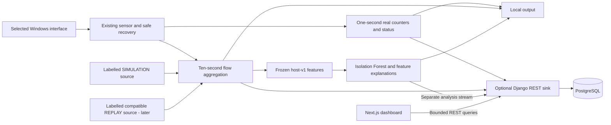

# Architecture

Sprint 1 sign-off, 2026-09-12: **PASS for Ethernet 3 own-host scope**. The accepted
thirty-minute run, fresh live repeats and test-only unavailable HTTP consumer
close the evidence gates without changing production sensor code in this task.
See SPRINT1_FEASIBILITY_REPORT.md. No backend or later sprint was started.

Reduced scope accepted 2026-09-11. The four product modules are Live Network Monitor, Anomaly Detection Engine, Explainable Threat Analysis, and Network Recovery & Demo Lab. Existing Sprint 1 sensor/recovery/diagnostic code and tests are preserved; this document does not authorize new implementation.

## Components and ownership

Use one modular Django application, PostgreSQL, a Next.js dashboard, and the existing independently runnable native Windows sensor. Scapy + Npcap is the proven capture choice; do not replace working capture or install an alternative without a demonstrated need. Sensor and detection stay modular Python packages; capture and training never execute inside Django requests.

Sprint 2 introduces monitoring and telemetry Django apps with minimal local authentication, simple persistence and REST ingestion/read APIs. Sprint 3 adds the dashboard. Sprint 4 adds one Isolation Forest and a small detection app for manifests/results; Sprint 5 adds explanations and lab sources. These app boundaries support four modules; no incident, inventory or enterprise accounts system is required.

The model produces Normal / Anomalous and an unusualness score only on complete compatible ten-second windows. Pure explanation/rule functions describe observed feature deviations and benign alternatives. No weighted risk engine or incident correlation is required. A rule-only result has unavailable ML, never a fabricated score. The browser presents evidence and cannot capture packets or infer attack certainty.

## Runtime and contracts

The sensor owns local authorization, session UUIDs, bounded capture/queues, flow aggregation, status and feature extraction. It works without Django, PostgreSQL, a model or backend network access. It has no database credentials. Future inference is outside callbacks, with bounded processing so model errors/lag cannot block monitoring. HTTP is an optional sink, registered only for upload with a restricted source credential.

Capture callbacks normalize whitelisted metadata and enqueue it. Preserve the existing flow and host-v1 contracts, caps and two cadences; the backend adapts them into persistence without moving capture into the web application. Local JSON output is currently synchronous, so blocked output and OS calls remain timing limitations to measure.

Keep telemetry and analysis acknowledgments separate. Register session/mode/profile for upload, validate sizes/quality/versions and acknowledge only durable transactional acceptance. Retry with stable batch and record IDs. Analysis references accepted features and reports the actual trusted local model/rule versions. Incompatible analysis cannot discard valid telemetry. Backend outage uses a bounded metadata-only spool/retry policy when implemented; old-data discard is explicit and local observation continues.

Every record/view retains immutable LIVE / SIMULATION / REPLAY and source/run/session. Live baseline training uses reviewed genuine traffic for the same measurement profile. Synthetic/replayed data never enters LIVE implicitly. Simulation runs use separate session/state/credential context and generate in-memory metadata without transmitting packets. Replay preserves original event time and processing time; incompatible public feature tables remain separate offline inputs.

## Laptop runtime and update transport

The planned local stack is one Django process, PostgreSQL, one Next.js process and the existing sensor. Training and lab runs are explicit local CLI operations; diagnostic observers are opt-in existing helpers, not production services. Bind web/database access to loopback, with minimal Django session/CSRF protection and separate upload credentials; see SECURITY_RULES.md.

REST polling is the initial dashboard transport, targeting approximately one-second refresh of bounded latest samples/status. Measure latency and resource cost in Sprint 3; no Channels, WebSocket ticket or Redis dependency is assumed in Sprint 2. If push becomes necessary, record a decision and use authorized post-commit socket hints with REST reconciliation. An in-memory Channels layer requires ingestion and consumers in the same single ASGI process; external sensor/CLI processes use HTTP. No multiworker/cloud requirement.

Use local management commands/native scheduling for bounded cleanup, and trusted local CLI training/save/load/selection with a recorded actual model version. Never spawn untracked jobs from requests. Celery, microservices, enterprise reports/notifications, remote capture/job controls and cloud deployment are OUT OF SCOPE. Redis is OUT OF SCOPE unless a later measured core necessity is explicitly accepted.

## Failure behaviour

| Failure | Required behaviour |
| --- | --- |
| Missing Npcap/permissions/interface | Actionable error; genuine OS counters only when available, packet flows/features unavailable. Counters-only does not pass the packet gate. |
| Known monitored-interface loss | Immediate explicit loss/recovery status, partial old windows, bounded stop/join, revalidate original alias/GUID, refresh addresses and open new session/counter baseline. No automatic interface substitution. |
| Gap, sleep/resume or clock discontinuity | Missing coverage, never zero traffic; close/invalidate affected windows and start a compatible new epoch. No windows or rolling explanation state spanning gaps. |
| Unexpected worker error, changed GUID or failed shutdown | Explicit fatal failure; no unsafe restart or network/driver configuration change. |
| Backend unavailable | Local operation continues. Sprint 1 proves this with a test-only bounded HTTP mirror and explicit counted discards; future production spool/retry/delivery still needs integration validation. |
| Stale sensor / lost browser connection | Last-observed time and unknown current traffic; REST retry/backoff and authoritative refresh. |
| No model or incompatible/partial feature | Continue collection; ML unavailable/unscored. Valid observed idle may score later; capture absence may not. |
| Queue/flow/disk pressure | Preserve caps, count loss, mark coverage/partial state and reject ingestion visibly if storage cannot recover. |
| No anomalies | Useful rates, packets, protocols, flows and history; no secure-network verdict. |
| Post-NAT/unknown attribution | Host/interface aggregate only; no remote-device traffic claims or device scores. |
| SIMULATION/REPLAY unavailable | Explicit unavailable lab state; no prefilled findings or synthetic LIVE fallback. |

Recovery defaults and all Sprint 1 numerical gates are unchanged. Historical
termination cause remains unproven; subsequent recovery cleanup, accepted
uninterrupted stability and fresh clean exits support the scoped Sprint 1 PASS.
See SPRINT1_FEASIBILITY_REPORT.md for the evidence and qualifications.

## Decision register

ADR-022 - **Accepted for Sprint 1 evidence only, 2026-09-12:** attach a test-only
optional HTTP health mirror at the existing sensor emission boundary. Reason:
the old preflight-exception test could not prove local operation during an HTTP
outage. Consequences: actual POST to a reserved non-listening loopback endpoint,
0.2-second socket timeout, local flushed output first, one attempt followed by
an open circuit, no queue/retries, and counted undelivered copies. Live controlled
TCP/UDP and windows continue after failure. No production sensor/client/service
or ingestion schema is added. Future transport durability/reconnect/security
requires its own authorized implementation and integration evidence.

ADR-021 - **Accepted, 2026-09-12; live cadence validation passed:** anchor
capture health deadlines to each session's monotonic origin, separately from
the last actual counter measurement. Reason: the official 1,800-second run
emitted only 1,669 valid samples because collection overhead accumulated after
each one-second wait. Consequences: retain actual elapsed-time rates, skip
missed deadlines without synthetic catch-up records, reset cadence with each
recovered session, and preserve all failure/recovery and acceptance thresholds.
Synchronous OS/output delays remain possible; the full repeat passed with 1,799
valid samples, all checks true and exit 0.
Evidence and offline regression are in SPRINT1_FEASIBILITY_REPORT.md.

ADR-019 — **Accepted, 2026-09-11: reduced academic scope.** Reason: deliver a clearer, defensible M.Sc. project using proven Sprint 1 work. Consequences: four core modules, seven sprints numbered 0–6, no incident/risk/enterprise feature delivery, no sensor/test rewrite, and all S1-01–S1-08 gates remain mandatory. Sprint 2 is backend-only; Sprint 3 is dashboard; Sprint 4 is one Isolation Forest; Sprint 5 is feature explanations and labelled labs; Sprint 6 is integration/evaluation/submission. Basic authorization, metadata privacy, provenance, retention and genuine measurement remain required. Replaces older roadmap tiers and incident/demo policy; historical evidence is retained.

ADR-020 — **Accepted planning choice, 2026-09-11; performance validation pending: REST first and minimal local access.** Reason: a single-operator laptop needs simple telemetry APIs before push/auth orchestration. Consequences: Django session/CSRF and separate source credentials are the starting access design; one-second bounded polling is evaluated in Sprint 3. ADR-005's PostgreSQL durability remains; its required socket transport and ADR-006's mandatory ASGI/Channels setup are superseded. Single-process restrictions still apply if Channels is later justified. No Redis unless necessity is demonstrated and separately accepted; no Celery or cloud requirement. No security or latency pass is claimed.

Decisions 001–018 below retain the original Sprint 1 reasoning. Earlier device-model, browser-job and socket proposals are historical or conditional under ADR-019/020, not active deliverables.

ADR-018 — **Accepted for opt-in diagnosis only**: use a separate local diagnostic
observer to record native process exit independently of the capture interpreter,
plus private fault-handler and lifecycle text logs. Reason: the USB recovery run
ended without Python finalization. Consequences: extra process only for explicit
diagnostics, no automatic restart, no memory/payload dumps, no new production
service or acceptance relaxation. Observer timeout/cancellation is recorded
before stopping its own child tree; loss of both observer and child can still
prevent terminal evidence. This is instrumentation, not a proven native fix.

ADR-017 — **Accepted for local Sprint 1 implementation; live recovery validation
pending**: supervise independently bounded capture sessions on known interface
loss. Reason: a reproduced Wi-Fi down-state exception should expose missing
coverage and permit conservative recovery. Revalidate the same alias/GUID and
refresh addresses; close partial windows and reset counters/aggregation under a
new session UUID linked by run ID. Consequences: gap status must never become
valid zero traffic; summaries span sessions but features do not. Any gap prevents
uninterrupted stability acceptance. Retry defaults are 2 seconds / 30-second
maximum per loss, configurable within hard limits and the finite run duration.
Unexpected exceptions and failed worker shutdown remain fatal. Synchronous
OS/output calls limit guarantees about wall-clock cancellation; no network
configuration changes, extra services or background recovery workers are added.

Sprint 1 continuation ADR-016: freeze host-v1's seven reconstructible values and
add local resource/counter telemetry plus finite opt-in validation scripts. This
permits evidence collection without any web/model dependency. Retain selected
address context for reconstruction; protect it as private metadata. Late drops
invalidate remaining session windows conservatively. A separate same-device
reference parser checks accounting but cannot detect shared Npcap/offload blind
spots. **Accepted for Sprint 1 implementation; hardware validation pending**.
Reasons: close feature/reliability evidence gaps without enlarging the MVP.
Consequences: synchronous output latency and missing HTTP-sink integration remain
explicit limitations; kernel loss remains unknown. Full gates still precede web work.

| ADR | Decision | Reason and consequence | Status |
| --- | --- | --- | --- |
| 001 | Modular Django monolith plus local sensor | Clear privileges and ownership without many services | Accepted |
| 002 | Metadata/flow persistence, no payload by default | Reduces privacy and storage burden; limits content-based conclusions | Accepted |
| 003 | Isolation Forest plus separate interpretation | Scientific honesty; requires independent rule evaluation | Accepted |
| 004 | Provenance partition in every pipeline stage | Prevents demo/replay contamination; adds contract checks | Accepted |
| 005 | PostgreSQL plus post-commit socket hints | Simple durability; REST reconciliation required | Accepted durability; required sockets superseded by ADR-020 |
| 006 | Single ASGI process before Redis | Laptop simplicity; cannot scale workers with in-memory messaging | Conditional only if push justified; ADR-020 |
| 007 | Offline training, sensor-local inference | Keeps requests fast; requires trusted artifact distribution and version handshake | Accepted |
| 008 | Scapy-first capture spike, PyShark alternative | Scapy 2.7.0 with Npcap 1.88 demonstrates Phase 1B host capture; PyShark is unnecessary for this evidence. Sustained overhead remains to measure. | Accepted for Phase 1B |
| 009 | Host/interface-first observation | Remote-device attribution cannot be assumed from discovery/NAT; device models are OUT OF SCOPE under ADR-019 | Accepted |
| 010 | Independent sensor and two publication cadences | Useful without backend/model; real samples every second, findings from finalized 10-second windows | Accepted |
| 011 | Shared feature compatibility gate | Dataset column names alone do not establish live compatibility | Accepted |
| 012 | Local CLI controls/lab launch before browser jobs | Avoids an undocumented task queue and remote privileged execution in MVP | Accepted |
| 013 | Early age/row/disk telemetry budgets | A bounded capture queue does not bound PostgreSQL growth | Accepted |
| 014 | Phase 1A psutil-only runtime; fail-closed capture preflight | Npcap was absent during Phase 1A. Pin tested psutil 7.2.2 on Python 3.11.0; pure metadata fixtures prove aggregation only. | Historical Phase 1A; capture portion superseded by ADR-015 |
| 015 | One selected Npcap interface, Scapy AsyncSniffer and metadata-only queue | Phase 1B verifies Windows alias-to-index and Npcap mapping, store=False, non-promiscuous IP filter, callback normalization and independent timer-driven aggregation. Driver is manually installed. Queue/parser loss conservatively invalidates remaining session windows; kernel loss stays unknown. CLI prints summaries only; packet objects/payloads are not persisted. | Accepted for Phase 1B; full Sprint 1 remains partial |

Phases 1A/1B implement only sensor/ and tests/sensor/. Frontend, backend and detection remain future boundaries. Evidence is in [SPRINT1_FEASIBILITY_REPORT.md](SPRINT1_FEASIBILITY_REPORT.md).
